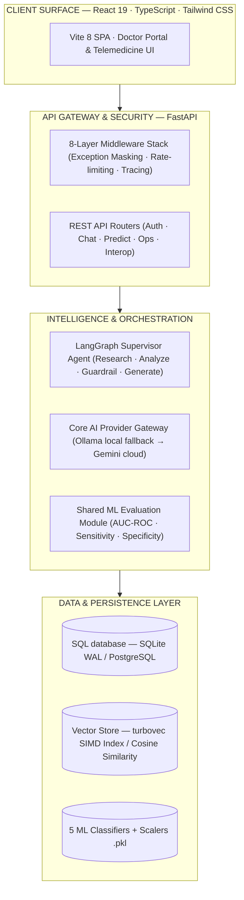

# 🏥 AI Healthcare System — Privacy-First Clinical AI & EHR Platform

> A production-ready, HIPAA-oriented clinical intelligence platform combining machine learning diagnostics, a multi-agent RAG chatbot, and full hospital operations. 

<div align="center">


<br/>

<p align="center">
  <a href="https://github.com/pavanbadempet/AI-Healthcare-System/actions/workflows/ci.yml"></a>
  <a href="https://github.com/pavanbadempet/AI-Healthcare-System/actions/workflows/codeql.yml"></a>
  <a href="LICENSE"></a>
  <a href="https://github.com/pavanbadempet/AI-Healthcare-System/stargazers"></a>
</p>

<h3>
  <a href="#-quick-start"><strong>Deploy in 60s</strong></a> &middot;
  <a href="#-core-pillars"><strong>Features</strong></a> &middot;
  <a href="#-system-architecture"><strong>Architecture</strong></a> &middot;
  <a href="#-rest-api-reference"><strong>API Reference</strong></a> &middot;
  <a href="#-aws-enterprise-deployment"><strong>Cloud Ops</strong></a>
</h3>

</div>

---

## ✨ Why Choose AI Healthcare System?

Existing healthcare software is either outdated, closed-source, or extremely complex to integrate. **AI Healthcare System** is a modern, open-source alternative built on a unified, high-performance stack (FastAPI + React 19).

It is designed to run **fully offline and private** (via Ollama) on standard consumer hardware, ensuring patient data remains secure inside your clinic's network, while remaining fully compatible with international interoperability standards like **FHIR R4**.

---

## ⚡ Core Pillars

<table>
<tr>
<td width="33%" valign="top">

### 🩺 5 ML Diagnostics
Instant screening for **Diabetes, Heart, Liver, Kidney, and Lung health** using calibrated XGBoost models. Every prediction includes gain-based SHAP explainability so clinicians know *why* a risk was flagged.

</td>
<td width="33%" valign="top">

### 💬 Multi-Agent RAG Chat
A supervisor-routed LangGraph reasoning graph that retrieves patient records with citation tracking. Safety guardrails gate and review all answers to prevent medical hallucinations.

</td>
<td width="33%" valign="top">

### 🏥 Hospital Operations
A complete system to run your facility: OPD/IPD encounters, ward bed allocations, pharmacy inventory, nursing task worklists, billing, and real-time WebSocket capacity telemetry.

</td>
</tr>
</table>

---

## 🏗 System Architecture



---

## 🛡 Security & Interoperability

* **FHIR R4 Compliance**: Out-of-the-box JSON serialization for Patients, Encounters, Observations, and MedicationRequests, enabling seamless integration with hospital EHRs (Epic, Cerner).
* **ABDM Consent Management**: Ready-to-go consent flows and callback handlers aligned with India's ABDM digital health stack.
* **HIPAA-Oriented Guardrails**: Outer middleware filters out raw database exceptions, preventing database structure or PII leaks in API error payloads. Clinician prediction overrides are recorded as PHI-free audit trails.

---

## ⚡ Quick Start

### Option A: Launch with Docker Compose (Recommended)
Launch the entire stack (FastAPI backend + React frontend + PostgreSQL + Redis) in a single command:
```bash
git clone https://github.com/pavanbadempet/AI-Healthcare-System.git
cd AI-Healthcare-System
cp .env.example .env          # Set GOOGLE_API_KEY & JWT SECRET
docker compose up --build
```

### Option B: Local Developer Mode
```bash
# Clone the repository
git clone https://github.com/pavanbadempet/AI-Healthcare-System.git
cd AI-Healthcare-System

# Set up python dependencies
python -m pip install -r requirements.txt

# Install React portal dependencies
npm --prefix frontend install
cp .env.example .env

# Run the REST API (Terminal 1)
uvicorn backend.main:app --reload --host 127.0.0.1 --port 8000

# Run the React client (Terminal 2)
npm --prefix frontend run dev
```

| Service | Access URL |
| :--- | :--- |
| **Doctor Portal** | [http://127.0.0.1:3000](http://127.0.0.1:3000) |
| **REST API Server** | [http://127.0.0.1:8000](http://127.0.0.1:8000) |
| **Interactive API Documentation** | [http://127.0.0.1:8000/docs](http://127.0.0.1:8000/docs) |

---

## 📡 REST API Reference

| Method | Endpoint | Description | Sample Request Payload |
| :---: | :--- | :--- | :--- |
| `POST` | `/v1/predict/diabetes` | Evaluates diabetes risk. | `{"hypertension": 1, "high_chol": 1, "bmi": 28.5, ...}` |
| `POST` | `/v1/predict/explain/diabetes` | Generates SHAP explanation attributes. | `{"hypertension": 1, "high_chol": 1, "bmi": 28.5, ...}` |
| `POST` | `/v1/chat/stream` | Multi-turn streaming chat with LangGraph RAG. | `{"messages": [{"role": "user", "content": "Explain my risk"}]}` |
| `POST` | `/v1/predict/reviews` | Logs doctor audit decisions for model predictions. | `{"patient_id": 1, "prediction_type": "diabetes", ...}` |

---

## ☁ AWS Enterprise Deployment

APEX includes complete Terraform configurations to spin up a production-ready, scalable infrastructure on AWS:
* **Amazon EKS**: Kubernetes cluster for horizontal backend scaling.
* **Amazon RDS PostgreSQL**: Managed, pooled relational database.
* **Amazon ElastiCache Redis**: High-throughput session caching.
* **Terraform IaC**: Deploy with `cd terraform && terraform init && terraform apply`.

---

## 🤝 Contributing & Tests

All tests must pass in CI before merging.

```bash
# Run the complete test suite with coverage
python -m pytest tests/ -v

# Run the frontend unit tests
npm --prefix frontend run test
```

---

## 📄 License

MIT License — Copyright © 2026 **Pavan Badempet**, Shiva Prasad Anagondi, Prashanth Cheerala. See [LICENSE](LICENSE) for details.

---

<div align="center">

### **If you find this project useful, give it a ⭐ star!**

</div>
