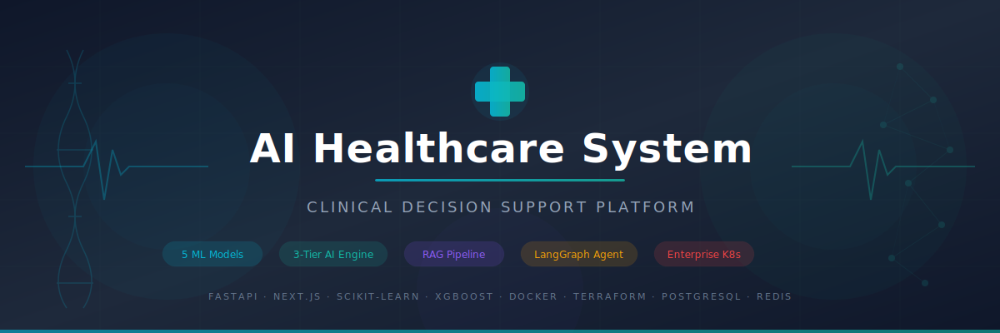
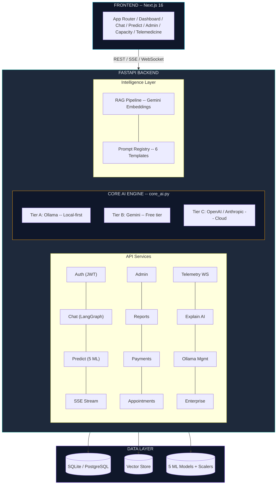
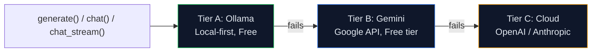
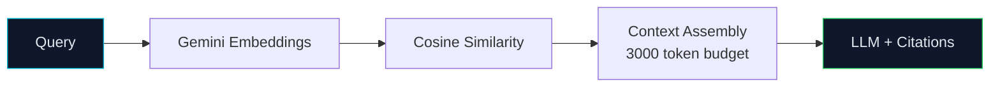
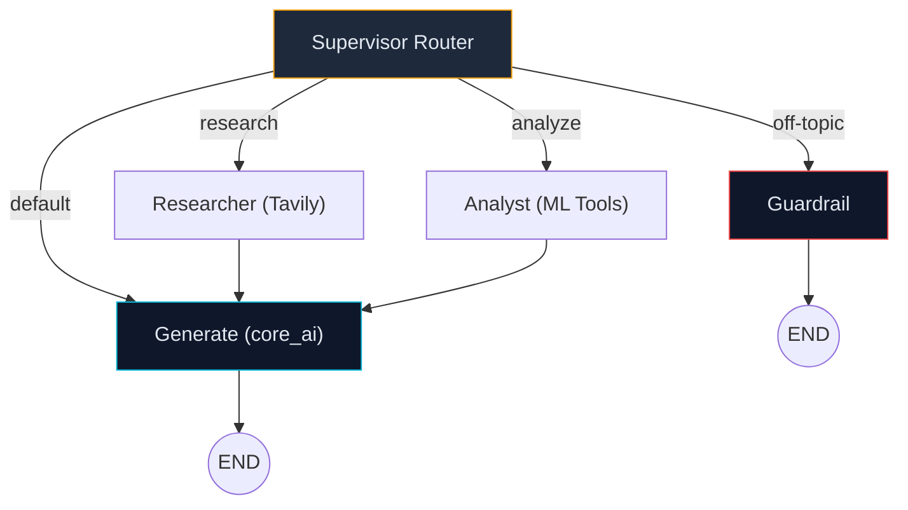

<div align="center">



<br/>

<p>
  <a href="https://github.com/pavanbadempet/AI-Healthcare-System/actions/workflows/ci.yml"></a>
  <a href="https://github.com/pavanbadempet/AI-Healthcare-System/actions/workflows/codeql.yml"></a>
  <a href="https://github.com/pavanbadempet/AI-Healthcare-System/blob/main/LICENSE"></a>
  <a href="https://github.com/pavanbadempet/AI-Healthcare-System/stargazers"></a>
  <a href="https://github.com/pavanbadempet/AI-Healthcare-System/issues"></a>
  <a href="https://github.com/pavanbadempet/AI-Healthcare-System/pulls"></a>
</p>

<p>
  
  
  
  
  
  
</p>
<p>
  
  
  
  
  
  
</p>

<p>
  <a href="#-quick-start"><strong>Quick Start</strong></a> &middot;
  <a href="#-architecture"><strong>Architecture</strong></a> &middot;
  <a href="#-ml-models"><strong>ML Models</strong></a> &middot;
  <a href="#-3-tier-ai-engine"><strong>AI Engine</strong></a> &middot;
  <a href="#-rag-pipeline"><strong>RAG Pipeline</strong></a> &middot;
  <a href="#-api-reference"><strong>API Docs</strong></a> &middot;
  <a href="#-deployment"><strong>Deploy</strong></a>
</p>

</div>


## Feature Highlights

<table>
<tr>
<td width="33%" valign="top">

### 5 ML Diagnostic Models
Diabetes, Heart, Liver, Kidney, Lungs -- trained on real clinical datasets (BRFSS, Cleveland, ILPD, UCI CKD) with SHAP explainability and confidence scoring.

</td>
<td width="33%" valign="top">

### 3-Tier AI Inference
**Ollama > Gemini > Cloud** automatic fallback. Local-first inference option for sensitive workflows, free Gemini tier, or OpenAI/Anthropic via headers. Zero vendor lock-in.

</td>
<td width="33%" valign="top">

### RAG Medical Chat
Gemini embeddings + vector store + LangGraph agent. Personalized responses grounded in patient history with citation tracking and token budget management.

</td>
</tr>
<tr>
<td width="33%" valign="top">

### Enterprise Security
JWT + bcrypt auth, RBAC (patient/doctor/admin), audit logging, rate limiting, PII redaction, HIPAA/GDPR-oriented helpers, and 7-layer middleware stack.

</td>
<td width="33%" valign="top">

### 5 Deployment Options
Docker Compose, Enterprise Stack (7 services), Render PaaS, Kubernetes (3-replica HA), Terraform AWS (VPC + EKS + RDS + ElastiCache).

</td>
<td width="33%" valign="top">

### 8 CI/CD Pipelines
Pytest + coverage, CodeQL SAST, Docker GHCR builds, HuggingFace sync, Dependabot, release drafter, stale bot, and Render keep-alive.

</td>
</tr>
</table>

> **Built for portfolios, built for production.** This is not a tutorial project -- it is a full-stack healthcare platform demonstrating ML engineering, LLM orchestration, RAG architecture, and DevOps maturity in a single cohesive codebase.


<details>
<summary><strong>Table of Contents</strong></summary>

- [Quick Start](#-quick-start)
- [Architecture](#-architecture)
- [ML Models (5)](#-ml-models)
- [3-Tier AI Engine](#-3-tier-ai-engine)
- [RAG Pipeline](#-rag-pipeline)
- [LangGraph Agent](#-langgraph-medical-agent)
- [Prompt Registry](#-prompt-registry)
- [API Reference](#-api-reference)
- [Pydantic Schemas](#-pydantic-schemas)
- [Frontend](#-frontend)
- [Database Layer](#-database-layer)
- [Security Posture](#-security-posture)
- [CI/CD Pipelines](#-cicd-pipelines)
- [Telemetry WebSocket](#-telemetry-websocket)
- [Deployment](#-deployment)
- [Project Structure](#-project-structure)
- [Environment Variables](#-environment-variables)
- [Contributing](#-contributing)
- [License](#-license)

</details>

---

## Quick Start

**Prerequisites:** Python 3.11+ | Node.js 20.9+ | (Optional) [Ollama](https://ollama.com)

```bash
git clone https://github.com/pavanbadempet/AI-Healthcare-System.git
cd AI-Healthcare-System
python -m pip install -r requirements.txt
npm --prefix frontend install
cp .env.example .env   # set GOOGLE_API_KEY + SECRET_KEY

# Run
uvicorn backend.main:app --reload --host 127.0.0.1 --port 8000
npm --prefix frontend run dev -- -H 127.0.0.1 -p 3000
```

---

## Architecture



| Decision | Rationale |
|----------|-----------|
| **All AI through `core_ai.py`** | Single gateway prevents provider lock-in; enforces audit logging |
| **Prompts in `prompt_registry.py`** | No inline prompts; versioned, auditable, A/B testable |
| **ML loading via `prediction.py`** | Centralized lifecycle; hot-reload via `/admin/reload_models` |
| **`DATABASE_URL` from env** | SQLite (dev) to PostgreSQL (prod) seamlessly |

---

## ML Models

Five scikit-learn/XGBoost models trained on public clinical datasets:

| # | Model | Dataset | Algorithm | Features | Endpoint |
|---|-------|---------|-----------|----------|----------|
| 1 | **Diabetes** | BRFSS 2015 (CDC) | XGBoost | 9 | `POST /predict/diabetes` |
| 2 | **Heart** | Cleveland UCI | Ensemble | 13 | `POST /predict/heart` |
| 3 | **Liver** | ILPD | Ensemble + Scaler | 10 | `POST /predict/liver` |
| 4 | **Kidney** | UCI CKD | Classifier + Scaler | 24 | `POST /predict/kidney` |
| 5 | **Lungs** | Lung Survey | Classifier + Scaler | 15 | `POST /predict/lungs` |

**SHAP Explainability** on 3 models: `POST /predict/explain/{diabetes,heart,liver}`

```json
{
  "prediction": "High Risk",
  "confidence": 78.5,
  "risk_level": "High",
  "disclaimer": "This is an AI-assisted screening tool, not a medical diagnosis..."
}
```

---

## 3-Tier AI Engine

**File:** `backend/core_ai.py` -- The single gateway for ALL AI inference.



| Tier | Provider | Privacy | Cost |
|------|----------|---------|------|
| **A** | Ollama | No cloud provider when configured locally | Free |
| **B** | Gemini | Cloud API | Free tier |
| **C** | OpenAI/Anthropic | Cloud API | Pay-per-use |

Key: Fuzzy model matching, 3-attempt retry, dual-endpoint fallback, 30s TTL cache, SSE streaming.

---

## RAG Pipeline

**File:** `backend/rag.py`



| Component | Implementation |
|-----------|---------------|
| Embedding | `text-embedding-004` (FREE Gemini) |
| Vector Store | Pickle-persisted, cosine similarity |
| Token Budget | 3,000 tokens, max 10 chunks |
| Governance | Patient scope (all users) vs Global scope (doctors/admins only) |

---

## LangGraph Medical Agent

**File:** `backend/agent.py`



---

## Prompt Registry

**File:** `backend/prompt_registry.py` -- 6 version-controlled templates:

| Name | Description |
|------|-------------|
| `chat_system` | Main chatbot prompt with context injection |
| `medical_qa` | RAG-grounded Q&A with citations |
| `symptom_analysis` | Structured analysis with red-flag detection |
| `report_summary` | Health record summarization |
| `risk_assessment` | Prediction explanation |
| `streaming_system` | Token-efficient SSE prompt |

---
## API Reference

<details>
<summary><strong>All Endpoints (click to expand)</strong></summary>

| Method | Endpoint | Auth | Description |
|--------|----------|------|-------------|
| `POST` | `/signup` | No | Register new user |
| `POST` | `/token` | No | Login, returns JWT |
| `GET` | `/profile` | Yes | Get profile |
| `PUT` | `/profile` | Yes | Update profile |
| `GET` | `/users` | Admin | List users |
| `GET` | `/users/{id}/full` | Admin | Full user dossier |
| `POST` | `/predict/diabetes` | No | Diabetes screening (9 features) |
| `POST` | `/predict/heart` | No | Heart detection (13 features) |
| `POST` | `/predict/liver` | No | Liver detection (10 features) |
| `POST` | `/predict/kidney` | No | Kidney disease (24 features) |
| `POST` | `/predict/lungs` | No | Respiratory (15 features) |
| `POST` | `/predict/explain/{model}` | No | SHAP explanation |
| `POST` | `/admin/reload_models` | Admin | Hot-reload ML models |
| `POST` | `/chat` | Yes | AI chat with LangGraph + RAG |
| `GET` | `/chat/history` | Yes | Chat history (last 100) |
| `DELETE` | `/chat/history` | Yes | Clear history |
| `POST` | `/chat/stream` | Yes | SSE streaming chat |
| `GET` | `/chat/context` | Yes | Debug RAG context |
| `GET` | `/chat/suggestions` | Yes | Dynamic starter questions |
| `POST` | `/records` | Yes | Save health record |
| `GET` | `/records` | Yes | Get records |
| `DELETE` | `/records/{id}` | Yes | Delete record |
| `POST` | `/analyze/report` | Yes | Vision AI lab report analysis |
| `GET` | `/download/health-report` | Yes | PDF health report |
| `POST` | `/explain/` | Yes | AI prediction explanation |
| `POST` | `/appointments/` | Yes | Book appointment |
| `GET` | `/appointments/doctors` | No | List doctors |
| `POST` | `/payments/create-order` | Yes | Razorpay order |
| `POST` | `/payments/verify` | Yes | Verify payment |
| `GET` | `/admin/stats` | Admin | System statistics |
| `GET` | `/ai/models` | No | List Ollama models |
| `POST` | `/ai/models/pull` | Admin | Pull model (SSE) |
| `WS` | `/telemetry/stream` | No | Hospital telemetry |
| `GET` | `/healthz` | No | Health check |

</details>

---

## Frontend

**Stack:** Next.js 16 (App Router) + TypeScript + Tailwind CSS

| Route | Page |
|-------|------|
| `/dashboard` | Patient Dashboard |
| `/chat` | AI Medical Chatbot (SSE) |
| `/predict` | ML Diagnostic Predictions |
| `/profile` | Profile Management |
| `/admin` | Admin Panel |
| `/capacity` | Hospital Capacity (WebSocket) |
| `/telemedicine` | Video Consultations |
| `/patients` | Patient Management |
| `/pricing` | Subscription Tiers |

---

## Database Layer

**File:** `backend/database.py` -- SQLAlchemy, auto-detects SQLite vs PostgreSQL.

| Model | Table | Key Fields |
|-------|-------|------------|
| `User` | `users` | id, username, role, email, full_name, health fields, plan_tier |
| `HealthRecord` | `health_records` | id, user_id, record_type, data (JSON), prediction |
| `ChatLog` | `chat_logs` | id, user_id, role, content, timestamp |
| `AuditLog` | `audit_logs` | id, admin_id, target_user_id, action, details |
| `Appointment` | `appointments` | id, user_id, doctor_id, specialist, date_time, status |

Features: SQLite WAL mode, PostgreSQL connection pooling, auto-migration, `postgres://` fix.

---

## Security Posture

| # | Middleware | Purpose |
|---|-----------|---------|
| 1 | `RateLimitMiddleware` | 60 req/min per IP |
| 2 | `TrustedHostMiddleware` | Allowlisted hosts only |
| 3 | `CORSMiddleware` | Origin-restricted |
| 4 | `SecurityHeadersMiddleware` | X-Frame-Options, nosniff |
| 5 | `GZipMiddleware` | Compression (1000+ bytes) |
| 6 | `ExceptionMiddleware` | No PII in errors |
| 7 | `LoggingMiddleware` | Request timing |

**Auth:** JWT (HS256, 30min) + bcrypt + RBAC (patient/doctor/admin)
**Privacy:** PII redaction, audit logging, medical disclaimers, per-user data collection flag
**Enterprise:** Prometheus metrics, compliance-oriented audit helpers, Redis rate limiting

---

## CI/CD Pipelines

**8 GitHub Actions workflows:**

| Workflow | Trigger | Purpose |
|----------|---------|---------|
| CI Tests | Push/PR | pytest + coverage |
| CodeQL | Push/PR + weekly | SAST scanning |
| Docker | Push/PR | Build to `ghcr.io` |
| HuggingFace | Push to main | Deploy to HF Spaces |
| Keep-Alive | Scheduled | Prevent Render cold starts |
| Labels | Push to main | Sync GitHub labels |
| Release Drafter | Push/PR | Auto release notes |
| Stale Bot | Scheduled | Close stale issues |

Plus: Dependabot (4 ecosystems), CODEOWNERS, Issue/PR templates, FUNDING.yml.

---

## Telemetry WebSocket

`WS /telemetry/stream` -- pushes JSON every 2 seconds with census, capacity, department loads, bed units, ED wait times, surge predictions.

---

## Deployment

Do not deploy this system directly from a passing local test run. Before any production rollout, complete the gate in [`docs/PRODUCTION_READINESS_GATE.md`](docs/PRODUCTION_READINESS_GATE.md) and run:

```bash
python scripts/production_readiness_check.py
```

The gate covers backend verification, database readiness, lakehouse/data processing, monitoring, security, AI safety, rollback, and operational signoff.

| Option | Command | Services |
|--------|---------|----------|
| **Docker Compose** | `docker compose up --build` | Backend + Frontend |
| **Enterprise** | `docker compose -f docker-compose.enterprise.yml up` | + PostgreSQL, Redis, Prometheus, Grafana, Jaeger, MLflow |
| **Render** | Auto-deploy from `render.yaml` | Free tier, Singapore |
| **Kubernetes** | `kubectl apply -f k8s/` | 3 backend + 2 frontend replicas, PVC storage |
| **Terraform AWS** | `cd terraform && terraform apply` | VPC, EKS, RDS, ElastiCache, S3, EFS, ALB, Route53 |

---

## Project Structure

<details>
<summary><strong>Full tree</strong></summary>

```
AI-Healthcare-System/
|-- backend/
|   |-- main.py              # FastAPI entry, middleware
|   |-- core_ai.py           # 3-tier AI engine
|   |-- prediction.py        # 5 ML prediction endpoints
|   |-- schemas.py           # Pydantic schemas
|   |-- models.py            # SQLAlchemy ORM
|   |-- database.py          # DB config
|   |-- auth.py              # JWT, RBAC
|   |-- chat.py              # LangGraph chat
|   |-- streaming_chat.py    # SSE streaming
|   |-- chat_context.py      # RAG context builder
|   |-- rag.py               # Vector store
|   |-- agent.py             # LangGraph agent
|   |-- prompt_registry.py   # 6 prompt templates
|   |-- explainability.py    # SHAP
|   |-- admin.py             # Admin routes
|   |-- appointments.py      # Booking + Jitsi
|   |-- payments.py          # Razorpay
|   |-- report.py            # Vision + PDF
|   |-- security.py          # Rate limiter
|   |-- telemetry.py         # WebSocket
|   |-- enterprise_features.py
|   |-- ollama_routes.py
|   +-- train_*.py           # 5 training scripts
|
|-- frontend/                # Next.js 16
|-- tests/                   # pytest suite
|-- k8s/                     # Kubernetes manifests
|-- terraform/               # AWS IaC
|-- .github/workflows/       # 8 CI/CD pipelines
|-- docker-compose.yml
|-- docker-compose.enterprise.yml
+-- Dockerfile
```

</details>

---

## Environment Variables

```bash
GOOGLE_API_KEY=your_gemini_key    # Required: Gemini AI (free)
SECRET_KEY=random_string          # Required: JWT signing

DATABASE_URL=sqlite:///./healthcare.db   # or postgresql://...
OLLAMA_BASE_URL=http://127.0.0.1:11434  # Optional: local AI
OLLAMA_MODEL=llama3.2
GEMINI_MODEL=gemini-1.5-flash
```

---

## Contributing

See [CONTRIBUTING.md](CONTRIBUTING.md) | [CODE_OF_CONDUCT.md](CODE_OF_CONDUCT.md)

<a href="https://github.com/pavanbadempet/AI-Healthcare-System/graphs/contributors">
  
</a>

<details>
<summary><strong>Star History</strong></summary>
<p align="center">
  <a href="https://star-history.com/#pavanbadempet/AI-Healthcare-System&Date">
    
  </a>
</p>
</details>

---

## License

MIT License -- Copyright (c) 2025 **Pavan Badempet**, Shiva Prasad Anagondi, Prashanth Cheerala. See [LICENSE](LICENSE).

---

<div align="center">


<br/>

**If this project helped you, consider giving it a star**

<p>
  <a href="https://github.com/pavanbadempet/AI-Healthcare-System/stargazers"></a>
  <a href="https://github.com/pavanbadempet/AI-Healthcare-System/network/members"></a>
  <a href="https://github.com/pavanbadempet/AI-Healthcare-System/watchers"></a>
</p>

<sub>
<strong>Keywords:</strong> AI healthcare, machine learning diagnosis, medical chatbot, diabetes prediction, heart disease prediction, liver disease prediction, kidney disease prediction, lung cancer prediction, FastAPI healthcare API, LangGraph medical agent, RAG healthcare, SHAP explainability, Ollama local inference, Gemini healthcare, privacy-aware AI, healthcare ML models, clinical decision support, medical AI system, health prediction API, telemedicine platform, hospital capacity management, real-time telemetry, enterprise healthcare, Docker healthcare deployment, Kubernetes healthcare, Terraform AWS healthcare
</sub>

<br/><br/>

<sub>Made with love by <a href="https://github.com/pavanbadempet">Pavan Badempet</a></sub>

</div>
