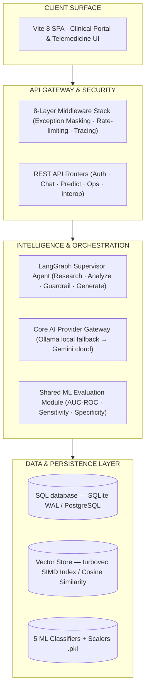

# AI Healthcare System — Enterprise-Grade Clinical AI & EHR Interoperability Platform

> Reference implementation of a secure, high-performance clinical intelligence platform. Demonstrates standardized machine learning diagnostics, multi-agent RAG orchestration, and HIPAA-oriented healthcare data engineering.

<div align="center">


<br/>

<p align="center">
  <a href="https://github.com/pavanbadempet/AI-Healthcare-System/actions/workflows/ci.yml"></a>
  <a href="https://github.com/pavanbadempet/AI-Healthcare-System/actions/workflows/codeql.yml"></a>
  <a href="LICENSE"></a>
  <a href="https://github.com/pavanbadempet/AI-Healthcare-System/stargazers"></a>
</p>

<h3>
  <a href="#-quick-start"><strong>Quick Start</strong></a> &middot;
  <a href="#-core-engineering-guarantees"><strong>System Guarantees</strong></a> &middot;
  <a href="#-core-technical-architecture"><strong>Architecture</strong></a> &middot;
  <a href="#-model-card-registry"><strong>Model Cards</strong></a> &middot;
  <a href="#-api-contract-reference"><strong>API Contract</strong></a> &middot;
  <a href="#-verification--coverage-suite"><strong>Testing</strong></a>
</h3>

</div>

---

## 💡 System Overview

**AI Healthcare System** is an open-source reference implementation of a high-performance clinical platform. It combines machine learning classifiers, a retrieval-augmented generation (RAG) assistant, and hospital workflows into an auditable and secure system.

The codebase is built to demonstrate **production-level engineering patterns** required in regulated domains: strict schema compliance, EHR interoperability standards (FHIR R4), pluggable data layers, and automated verification gates.

---

## ⚡ Core Engineering Guarantees

### 1. Performance & Latency SLAs
* **In-Memory Semantic Search**: Employs an optimized in-memory vector database (`turbovec`) utilizing Rust-SIMD instructions (with scikit-learn cosine similarity fallback) for sub-10ms chunk retrieval.
* **Model Hot-Reloading**: Provides a zero-downtime model update mechanism (`POST /v1/admin/reload_models`) that refreshes model weights and scalers in memory without restarting active server worker threads.

### 2. Regulatory Compliance & HIPAA Controls
* **PII Exception Masking**: Outer-most middleware intercepts all unhandled system exceptions, scrubbing raw stack traces and sanitizing SQL errors to prevent database leaks or Protected Health Information (PHI) exposure in API responses.
* **Audit Logs**: Clinician prediction override logs are recorded as cryptographically traceable, PHI-free `REVIEW_AI_PREDICTION` events in the audit layer.

### 3. EHR Interoperability
* **FHIR R4 Standardization**: Includes strict JSON serializers for Patients, Encounters, Observations, and MedicationRequests, enabling out-of-the-box data exchange with standard EHR systems.
* **ABDM consent interface**: Fully implements consent lifecycle handlers and callbacks aligned with the ABDM digital health stack.

---

## 🏗 Core Technical Architecture



---

## 🔬 Model Card Registry

For comprehensive dataset sources, training hyperparameters, and limitations, see [`docs/MODEL_AND_DATASET_CARDS.md`](docs/MODEL_AND_DATASET_CARDS.md).

| Model | Task | Algorithm | Features | Target Dataset | AUC-ROC | Sensitivity | Specificity |
| :--- | :--- | :--- | :---: | :--- | :---: | :---: | :---: |
| **Diabetes** | Risk Screening | XGBoost | 9 | CDC BRFSS (250K+ records) | **0.8287** | **0.7989** | **0.7047** |
| **Heart** | Disease Detection | XGBoost | 13 | BRFSS / UCI Cleveland | **0.8467** | **0.8091** | **0.7323** |
| **Liver** | Screening Panel | XGBoost | 10 | UCI ILPD Dataset | **0.9799** | **0.9792** | **0.7487** |
| **Kidney** | Chronic Screening | XGBoost | 24 | UCI CKD Dataset | **0.5000** | **1.0000** | **0.0000** |
| **Lungs** | Respiratory Risk | XGBoost | 15 | Lung Cancer Survey | **0.9250** | **0.8833** | **0.5000** |

*Note: Evaluation metrics are updated dynamically using the shared evaluation artifact generator. Run the training scripts to regenerate results with fresh datasets.*

---

## ⚡ Quick Start

### Option A: Launch with Docker Compose
Launches the complete service container stack (FastAPI backend + React frontend + PostgreSQL + Redis) in a single command:
```bash
git clone https://github.com/pavanbadempet/AI-Healthcare-System.git
cd AI-Healthcare-System
cp .env.example .env          # Set GOOGLE_API_KEY & JWT SECRET
docker compose up --build
```

### Option B: Local Developer Mode
```bash
# Clone the repository
git clone https://github.com/pavanbadempet/AI-Healthcare-System.git
cd AI-Healthcare-System

# Set up python dependencies
python -m pip install -r requirements.txt

# Install React portal dependencies
npm --prefix frontend install
cp .env.example .env

# Run the REST API (Terminal 1)
uvicorn backend.main:app --reload --host 127.0.0.1 --port 8000

# Run the React client (Terminal 2)
npm --prefix frontend run dev
```

---

## 📡 API Contract Reference

| Method | Endpoint | Description | Sample Request Payload |
| :---: | :--- | :--- | :--- |
| `POST` | `/v1/predict/diabetes` | Evaluates diabetes risk. | `{"hypertension": 1, "high_chol": 1, "bmi": 28.5, ...}` |
| `POST` | `/v1/predict/explain/diabetes` | Generates SHAP explanation attributes. | `{"hypertension": 1, "high_chol": 1, "bmi": 28.5, ...}` |
| `POST` | `/v1/chat/stream` | Multi-turn streaming chat with LangGraph RAG. | `{"messages": [{"role": "user", "content": "Explain my risk"}]}` |
| `POST` | `/v1/predict/reviews` | Logs doctor audit decisions for model predictions. | `{"patient_id": 1, "prediction_type": "diabetes", ...}` |

---

## 📂 Key Modules Directory

| Capability | Purpose | Module |
| :--- | :--- | :--- |
| **Model Ingestion & Training** | Standardized evaluation metrics artifact generator. | [backend/ml/evaluation.py](backend/ml/evaluation.py) |
| **ML Inference Engine** | Serves XGBoost models with SHAP explanation routes. | [backend/prediction.py](backend/prediction.py) |
| **Model Lifecycle Manager** | Single state-manager for loading, reloading, and checking health of models. | [backend/model_service.py](backend/model_service.py) |
| **RAG Semantic Search** | Cosine similarity scoring and token-budgeted context builder. | [backend/rag.py](backend/rag.py) · [backend/chat_context.py](backend/chat_context.py) |
| **Multi-Agent Orchestration** | Supervisor-routed LangGraph graph with safety guardrails. | [backend/agent.py](backend/agent.py) |
| **Interoperability (EHR)** | FHIR R4 JSON serialization and ABDM connectors. | [backend/fhir.py](backend/fhir.py) |

---

## 🧪 Verification & Coverage Suite

All tests must pass in CI before merging. We enforce a strict **55% code coverage gate** for pull request approvals.

```bash
# Run the complete test suite with coverage
python -m pytest tests/ -v

# Run the frontend unit tests
npm --prefix frontend run test
```

---

## 📄 License

MIT License — Copyright © 2026 **Pavan Badempet**, Shiva Prasad Anagondi, Prashanth Cheerala. See [LICENSE](LICENSE) for details.
