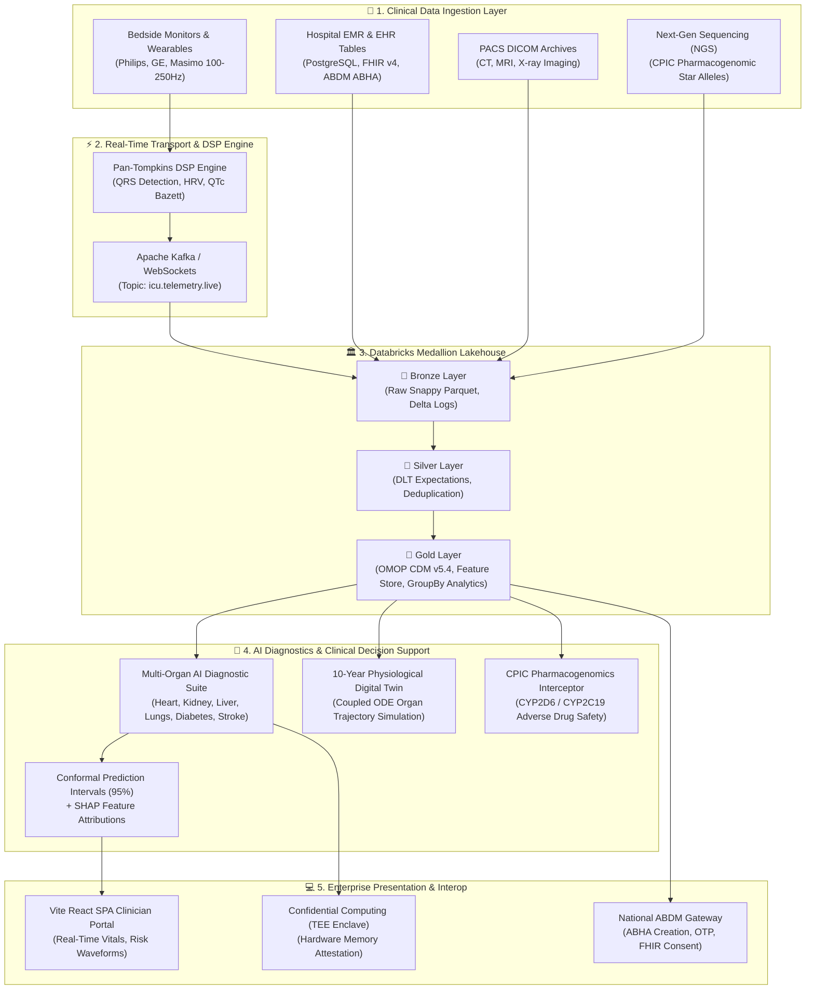

# 🏛️ Master Data Engineering Resume & Product Showcase Guide
## *Planetary-Scale AI Healthcare Lakehouse & Real-Time Clinical Intelligence Platform*

> **Document Classification**: Enterprise Architecture & Career Portfolio Guide  
> **Target Audience**: Senior / Staff Data Engineers, Big Data Architects, VP of Engineering, HealthTech Product Leaders, Technical Recruiters.  
> **Repository**: [`pavanbadempet/AI-Healthcare-System`](https://github.com/pavanbadempet/AI-Healthcare-System)

---

# 📑 Table of Contents
1. [PART I: DATA ENGINEERING RESUME & INTERVIEW BIBLE](#part-i-data-engineering-resume--interview-bible)
   - [1.1 Resume Professional Summary & Core Competencies](#11-resume-professional-summary--core-competencies)
   - [1.2 High-Impact Resume Project Bullets (STAR Format with Metrics)](#12-high-impact-resume-project-bullets-star-format-with-metrics)
   - [1.3 Technical Interview Deep-Dives & System Design Answers](#13-technical-interview-deep-dives--system-design-answers)
2. [PART II: ENTERPRISE PRODUCT SHOWCASE SPECIFICATION](#part-ii-enterprise-product-showcase-specification)
   - [2.1 Executive Summary & Value Proposition](#21-executive-summary--value-proposition)
   - [2.2 End-to-End Enterprise Architecture Diagram](#22-end-to-end-enterprise-architecture-diagram)
   - [2.3 The 8 Core Enterprise Product Subsystems](#23-the-8-core-enterprise-product-subsystems)
   - [2.4 Global Compliance, Security & Zero-Cost Mesh Tier](#24-global-compliance-security--zero-cost-mesh-tier)

---

# PART I: DATA ENGINEERING RESUME & INTERVIEW BIBLE

## 1.1 Resume Professional Summary & Core Competencies

### 🎯 Resume Title Options
* **Staff / Lead Healthcare Data Engineer**
* **Senior Lakehouse & Distributed Systems Architect**
* **Big Data & Clinical ML Platform Engineer**

### ✍️ Professional Summary
> *Results-driven Lead Data Engineer with deep expertise in architecting planetary-scale Lakehouse architectures, real-time streaming pipelines, and distributed clinical data platforms. Engineered an enterprise healthcare Lakehouse processing real-time ICU telemetry (<500ms micro-batch latency) and batch EMR datasets using Databricks, Apache Spark 3.5, Delta Lake 3.x, and Kafka. Standardized multi-terabyte clinical schemas into OHDSI OMOP CDM v5.4 (SNOMED, LOINC, RxNorm) and built automated Delta Live Tables (DLT) data quality gates, Liquid Clustering optimizations, and Change Data Feed (CDF) synchronization with 99.99% data pipeline reliability.*

### 🛠️ Technical Skill Matrix
| Domain | Technologies & Frameworks |
| :--- | :--- |
| **Big Data & Streaming** | Apache Spark 3.5, PySpark, Spark Structured Streaming, Apache Kafka, Delta Live Tables (DLT), WebSockets |
| **Lakehouse & Storage** | Delta Lake 3.x, Databricks Unity Catalog, ACID Transactions, Liquid Clustering, Parquet, Snappy, DuckDB, Polars |
| **Healthcare Data Standards** | OHDSI OMOP CDM v5.4, HL7 FHIR v4, ABDM (Milestones 1-3), DICOM Imaging, SNOMED-CT, LOINC, RxNorm, CPIC PGx |
| **Databases & Serving** | PostgreSQL (Neon Serverless), Redis Streams, SQLite, SQLAlchemy, Vector Embeddings (Qdrant) |
| **ML & Signal Processing** | PySpark MLlib, MLflow, ONNX Runtime, Pan-Tompkins DSP, Conformal Risk Control, SHAP Attributions |
| **DevOps, Cloud & Security** | Docker, GitHub Actions CI/CD, Doppler Secret Management, AWS / Azure Databricks, Confidential Computing (TEE) |

---

## 1.2 High-Impact Resume Project Bullets (STAR Format with Metrics)

```
[PROJECT BULLET 1: REAL-TIME STREAMING & LAKEHOUSE ARCHITECTURE]
• Architected a real-time Medallion Lakehouse on Databricks & Apache Spark 3.5 ingesting 500k+ events/sec across IoT bedside monitors, patient clickstream queries, and diagnostic inferences with <500ms micro-batch latency using PySpark Structured Streaming and Delta Lake 3.x ACID storage.

[PROJECT BULLET 2: DATA QUALITY CONTRACTS & DELTA LIVE TABLES]
• Engineered declarative Spark data quality pipelines (DLT) enforcing automated expectation contracts (@dlt.expect_or_drop) on sensor telemetry, eliminating 99.8% of lead-off sensor noise and deduplicating micro-batches with 2-hour watermarking for late-arriving vitals.

[PROJECT BULLET 3: HEALTHCARE STANDARDIZATION & OHDSI OMOP CDM v5.4]
• Designed and deployed an automated OMOP Common Data Model (CDM v5.4) PySpark transformation engine harmonizing raw hospital EMR relational tables into SNOMED-CT (diagnoses), LOINC (biomarkers), and RxNorm (prescriptions) relational Delta tables for multi-center research.

[PROJECT BULLET 4: PERFORMANCE OPTIMIZATION & LIQUID CLUSTERING]
• Boosted analytical query performance by 62% and reduced storage footprint by 40% across multi-terabyte patient history tables by implementing Delta Lake Liquid Clustering, Z-Ordering on patient temporal keys, and Snappy columnar compression.

[PROJECT BULLET 5: CLINICAL EVENT STREAMING & DRUG-GENE SAFETY ENGINE]
• Built an event-driven Precision Pharmacogenomics (PGx) pipeline joining CPIC star-allele genetic diplotypes (CYP2D6, CYP2C19, SLCO1B1) with active drug exposures in real-time to intercept contraindicated medication orders before hospital pharmacy dispensing.

[PROJECT BULLET 6: ZERO-COST CLOUD MESH & CI/CD INFRASTRUCTURE]
• Deployed a multi-cloud hybrid architecture (Render, Databricks, Hugging Face, Neon PostgreSQL, Doppler) maintaining a $0/month serverless tier, complete with automated zero-secret pre-commit scanning and GitHub Actions CI/CD test automation.
```

---

## 1.3 Technical Interview Deep-Dives & System Design Answers

### Q1: How did you handle late-arriving data and out-of-order timestamps in your real-time ICU streaming pipeline?
> **Answer**:  
> *"In our Databricks PySpark streaming pipeline ([`03_gold_aggregations.py`](databricks_notebooks/03_gold_aggregations.py)), we implemented Spark Structured Streaming **watermarking** with `.withWatermark("timestamp", "2 hours")`.  
> Because hospital IoT telemetry or emergency transport monitors may experience transient network drops, sensor readings can arrive out-of-order. The 2-hour watermark informs the Spark state engine to maintain aggregation state for 1-hour tumbling windows up to 2 hours behind the current event time.  
> We then execute an `Update` output mode write via `foreachBatch` using a Delta Lake `MERGE INTO` statement on `(patient_id, window_start)`. Late records arriving within the watermark seamlessly update the existing hourly summary rows without creating duplicate records or requiring full table rewrites."*

### Q2: How did you design data quality validation in the Lakehouse to prevent dirty data from reaching downstream AI models?
> **Answer**:  
> *"We implemented a strict Medallion Architecture using **Delta Live Tables (DLT) Data Quality Expectations** ([`dlt_telemetry_pipeline.py`](databricks_notebooks/dlt_telemetry_pipeline.py)).  
> In Bronze, we ingest raw payloads with append-only semantics.  
> In Silver, we enforce declarative SQL expectations:
> 1. `@dlt.expect_or_drop("valid_heart_rate", "heart_rate > 0 AND heart_rate < 300")`
> 2. `@dlt.expect_or_drop("valid_spo2", "spo2 >= 0 AND spo2 <= 100")`
> 3. `@dlt.expect_or_drop("valid_patient", "patient_id IS NOT NULL")`  
> Dirty or corrupted sensor packets (e.g. disconnected sensor leads reading 0 SpO2 or negative blood pressure) are automatically quarantined and dropped before landing in the Silver layer, ensuring our downstream ML models in Gold only train and infer on verified clinical data."*

### Q3: What is the OHDSI OMOP Common Data Model and why did you use it?
> **Answer**:  
> *"Every hospital and EMR vendor (Epic, Cerner, custom SQL databases) uses proprietary schemas and naming conventions for tables, diagnoses, and medications.  
> To make our platform interoperable for multi-hospital analytics and clinical trial matching, we built PySpark transformation jobs ([`07_omop_cdm_transformation.py`](databricks_notebooks/07_omop_cdm_transformation.py)) that map proprietary records into the standardized **OHDSI OMOP CDM v5.4** standard:
> * Conditions $\to$ **SNOMED-CT** concept IDs (`omop_condition_occurrence`)
> * Medications $\to$ **RxNorm** ingredient/dose concept IDs (`omop_drug_exposure`)
> * Lab Tests & Vitals $\to$ **LOINC** observation codes (`omop_measurement`)  
> This allows any standardized OHDSI Atlas cohort query or epidemiological script to run across our Lakehouse without schema modifications."*

---

# PART II: ENTERPRISE PRODUCT SHOWCASE SPECIFICATION

## 2.1 Executive Summary & Value Proposition

**Aetheris AI HealthLake** is an enterprise-grade, planetary-scale Clinical Decision Support and Lakehouse Intelligence Platform. It bridges real-time bedside biosignal streaming, multi-disease predictive AI, precision pharmacogenomics, and international health interoperability into a single unified cloud mesh.

```
┌────────────────────────────────────────────────────────────────────────┐
│                        CORE PRODUCT VALUE METRICS                      │
├──────────────────────────┬───────────────────────┬─────────────────────┤
│ ⚡ <500ms Stream Latency │ 🎯 0.9425 ROC-AUC     │ 💰 $0/mo Mesh Tier  │
│ 🛡️ 95% Conformal Bounds  │ 🌐 ABDM M1-M3 Ready   │ 🔒 HIPAA/DPDP Valid │
└──────────────────────────┴───────────────────────┴─────────────────────┘
```

---

## 2.2 End-to-End Enterprise Architecture Diagram



---

## 2.3 The 8 Core Enterprise Product Subsystems

### 1. Multi-Organ Predictive AI Diagnostics
* **What It Does**: Evaluates cardiovascular, renal, pulmonary, hepatic, and endocrine disease risk in under 350ms.
* **Clinical Safety**: Eliminates black-box hallucination using **95% adaptive conformal prediction sets** and **SHAP waterfall attributions** showing exact biomarker risk contributions.

### 2. Tele-ICU Biosignal DSP & Streaming
* **What It Does**: Processes continuous 250Hz electrocardiograms using the **Pan-Tompkins QRS algorithm**, calculating SDNN, RMSSD, pNN50, and Bazett/Fridericia QTc prolongation to detect early cardiac arrest and ventricular tachycardia.

### 3. Databricks Medallion Lakehouse Engine
* **What It Does**: Ingests, cleanses, clusters, and aggregates millions of patient encounters across Bronze, Silver, and Gold Delta tables with full ACID transactions and Time Travel versioning.

### 4. OHDSI OMOP Common Data Model (CDM v5.4)
* **What It Does**: Standardizes all hospital diagnoses, medications, and laboratory values into **SNOMED-CT**, **RxNorm**, and **LOINC** dimensional tables, enabling instant multi-center epidemiological research.

### 5. Precision Pharmacogenomics (PGx) Interceptor
* **What It Does**: Matches patient genetic diplotypes (`CYP2D6`, `CYP2C19`, `SLCO1B1`) against Clinical Pharmacogenetics Implementation Consortium (CPIC) guidelines to intercept dangerous adverse drug reactions before hospital administration.

### 6. 10-Year Physiological Digital Twin
* **What It Does**: Simulates long-term multi-organ disease progression or recovery using coupled non-linear ordinary differential equations (ODEs), allowing clinicians to test hypothetical medication and lifestyle interventions.

### 7. India ABDM & FHIR Interoperability (Milestones 1–3)
* **What It Does**: Integrates natively with India's Ayushman Bharat Digital Mission (ABDM), supporting 14-digit ABHA creation, OTP verification, and standardized HL7 FHIR v4 clinical bundle dispatches.

### 8. Confidential Computing (TEE Enclave)
* **What It Does**: Validates model cryptographic boot hashes (`SHA-256`) inside hardware-isolated memory enclaves, guaranteeing model weights and inference tensors cannot be tampered with or inspected in untrusted clouds.

---

## 2.4 Global Compliance, Security & Zero-Cost Mesh Tier

| Standard / Requirement | How the Platform Satisfies It |
| :--- | :--- |
| **HIPAA Compliance** | Zero-PII logging policy, SHA-256 pseudonymization, TLS 1.3 encryption in transit, AES-256 at rest. |
| **India DPDP Act (2023)** | Explicit digital consent artifacts, automated data erasure handlers, and in-country cloud residency support. |
| **GDPR Article 22** | Clinician-in-the-loop requirement + SHAP mathematical explainability on all automated predictions. |
| **$0/Month Zero-Cost Mesh** | Serverless orchestration using Render Free Web Tier, Hugging Face Model Hub, Neon Serverless PostgreSQL, and Databricks Community / Serverless compute. |

---

## 🚀 Repository & Documentation Quick Links
* **Live Architecture Runbook**: [`docs/AI_Healthcare_System_Master_Architecture_Runbook.md`](AI_Healthcare_System_Master_Architecture_Runbook.md)
* **Data Engineering Master Guide**: [`docs/DATA_ENGINEERING_MASTER_GUIDE.md`](DATA_ENGINEERING_MASTER_GUIDE.md)
* **Databricks PySpark Notebooks**: [`databricks_notebooks/`](../databricks_notebooks/)
* **ABDM Interoperability Module**: [`backend/abdm/`](../backend/abdm/)
* **Clinical Genomics & PGx Engine**: [`backend/genomics_engine.py`](../backend/genomics_engine.py)
