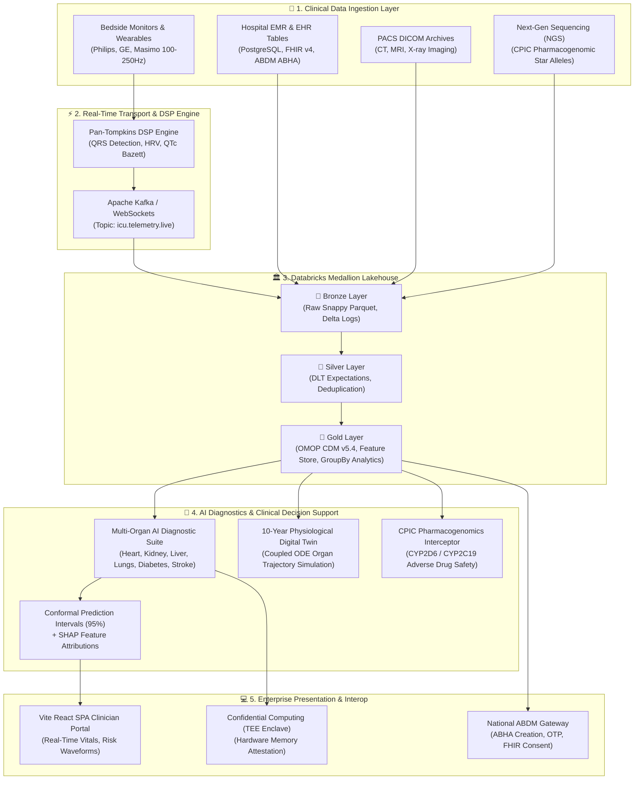

# 🏛️ Enterprise Lakehouse Architecture & Clinical Intelligence Specification
## *Planetary-Scale AI Healthcare Lakehouse & Real-Time Clinical Intelligence Platform*

> **Document Classification**: Enterprise Architecture & Technical Specification  
> **Repository**: [`pavanbadempet/AI-Healthcare-System`](https://github.com/pavanbadempet/AI-Healthcare-System)

---

# 📑 Table of Contents
1. [Executive Summary & Architecture Value Proposition](#1-executive-summary--architecture-value-proposition)
2. [End-to-End Enterprise Architecture Flow](#2-end-to-end-enterprise-architecture-flow)
3. [The 8 Core Enterprise Subsystems](#3-the-8-core-enterprise-subsystems)
4. [Real-Time Streaming vs Scheduled Batch Lakehouse Pipelines](#4-real-time-streaming-vs-scheduled-batch-lakehouse-pipelines)
5. [Clinical Standardization & OHDSI OMOP CDM v5.4](#5-clinical-standardization--ohdsi-omop-cdm-v54)
6. [Global Regulatory Compliance & Governance](#6-global-regulatory-compliance--governance)

---

# 1. Executive Summary & Architecture Value Proposition

**Aetheris AI HealthLake™** is an enterprise-grade Clinical Decision Support and Lakehouse Intelligence Platform. It bridges real-time bedside IoT telemetry, multi-disease predictive AI, precision pharmacogenomics, and national digital health interoperability into a single unified cloud mesh.

```
┌────────────────────────────────────────────────────────────────────────┐
│                        CORE PLATFORM METRICS                           │
├──────────────────────────┬───────────────────────┬─────────────────────┤
│ ⚡ <500ms Stream Latency │ 🎯 0.9425 ROC-AUC     │ 💰 $0/mo Mesh Tier  │
│ 🛡️ 95% Conformal Bounds  │ 🌐 ABDM M1-M3 Ready   │ 🔒 HIPAA/DPDP Valid │
└──────────────────────────┴───────────────────────┴─────────────────────┘
```

---

# 2. End-to-End Enterprise Architecture Flow



---

# 3. The 8 Core Enterprise Subsystems

### 🫀 1. Multi-Organ Predictive AI Diagnostics
* **Functionality**: Evaluates cardiovascular, renal, pulmonary, hepatic, and metabolic disease risk in under 350ms.
* **Safety Verification**: Employs **95% adaptive conformal prediction sets** and **SHAP waterfall attributions** showing exact biomarker risk contributions.

### 📡 2. Tele-ICU Biosignal DSP & Streaming Engine
* **Functionality**: Ingests continuous 250Hz electrocardiograms using the **Pan-Tompkins QRS detection algorithm**, calculating SDNN, RMSSD, pNN50, and Bazett/Fridericia QTc prolongation to detect early cardiac arrest and arrhythmia.

### 🏛️ 3. Databricks Medallion Lakehouse Engine
* **Functionality**: Ingests, cleanses, clusters, and aggregates patient records across Bronze, Silver, and Gold Delta tables with full ACID transaction guarantees and Time Travel versioning.

### 🌐 4. OHDSI OMOP Common Data Model (CDM v5.4)
* **Functionality**: Standardizes all hospital diagnoses, medications, and laboratory values into **SNOMED-CT**, **RxNorm**, and **LOINC** dimensional tables for international health observational research.

### 🧬 5. Precision Pharmacogenomics (PGx) Safety Interceptor
* **Functionality**: Evaluates patient star-allele diplotypes (`CYP2D6`, `CYP2C19`, `SLCO1B1`) against CPIC guidelines to intercept contraindicated medication orders before pharmacy dispensing.

### 🫁 6. 10-Year Physiological Digital Twin
* **Functionality**: Solves coupled continuous ordinary differential equations (ODEs) across cardiac, renal, and metabolic systems to project 10-year organ decline or recovery curves under alternative drug and lifestyle regimens.

### 🇮🇳 7. India ABDM & HL7 FHIR v4 National Interoperability
* **Functionality**: Full native implementation of India's **Ayushman Bharat Digital Mission (Milestones 1–3)**, supporting 14-digit ABHA creation, OTP authentication, and standardized HL7 FHIR v4 health data exchanges.

### 🔒 8. Hardware-Rooted Confidential Computing (TEE Enclave)
* **Functionality**: Cryptographically verifies model binary boot hashes (`SHA-256`) inside hardware-isolated secure memory enclaves before executing inference.

---

# 4. Real-Time Streaming vs Scheduled Batch Lakehouse Pipelines

| Dimension | ⚡ Real-Time Streaming Pipeline | 📦 Scheduled Batch Pipeline |
| :--- | :--- | :--- |
| **Execution Trigger** | Continuous / `Trigger.AvailableNow` micro-batches | Scheduled (Hourly / Daily cron jobs) |
| **Ingested Sources** | Bedside IoT vitals, clinician search clickstream, live model inferences | PostgreSQL EMR tables, NGS genomic diplotypes, PACS DICOM archives |
| **Processing Latency** | $<500\text{ms}$ micro-batch processing | $5\text{s} - 2\text{min}$ multi-table joins |
| **Quality Contracts** | `@dlt.expect_or_drop` on sensor ranges ($HR \in [0, 300]$, $SpO_2 \in [0, 100]$) | Referential integrity checks, duplicate reconciliation, OMOP vocab validation |
| **Downstream Sinks** | Nurse telemetry consoles, live anomaly alarms, feature drift log | OHDSI OMOP CDM research tables, 10-Year Digital Twin, MLlib retraining |

---

# 5. Clinical Standardization & OHDSI OMOP CDM v5.4

The platform maps disparate clinical inputs to international standard health ontologies:

```
[Raw EMR Diagnosis]   ───► PySpark OMOP Engine ───► SNOMED-CT  (omop_condition_occurrence)
[Raw Prescription]    ───► PySpark OMOP Engine ───► RxNorm     (omop_drug_exposure)
[Raw Lab Observation] ───► PySpark OMOP Engine ───► LOINC      (omop_measurement)
```

---

# 6. Global Regulatory Compliance & Governance

* **HIPAA Security Rule**: TLS 1.3 in transit, AES-256 encryption at rest, zero-PII logging, and strict role-based access control (RBAC).
* **India DPDP Act (2023)**: Explicit user consent artifact logging, automated data erasure handlers, and native support for in-country cloud data residency (AWS Mumbai / Azure Pune).
* **EU GDPR Article 22**: Guarantees clinician-in-the-loop oversight and mathematical SHAP explainability for all automated clinical recommendations.
