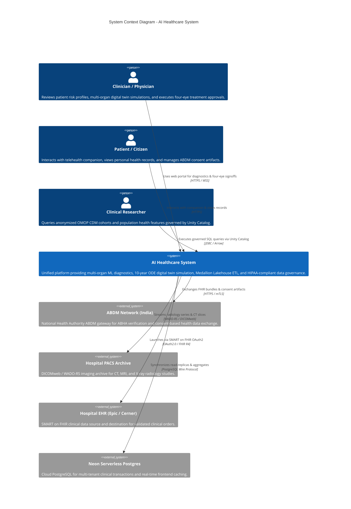
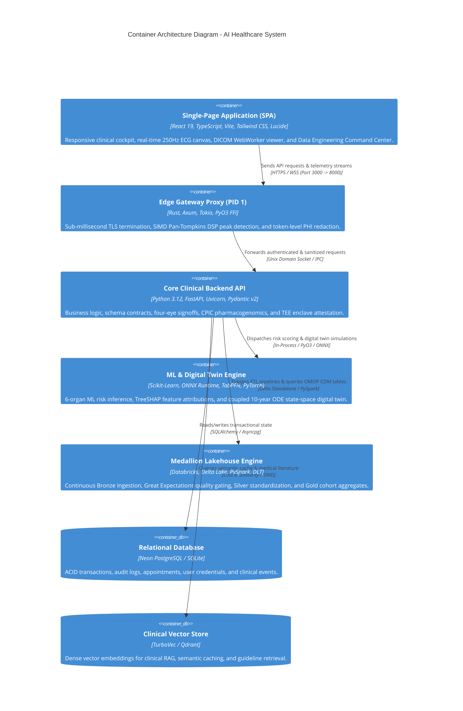
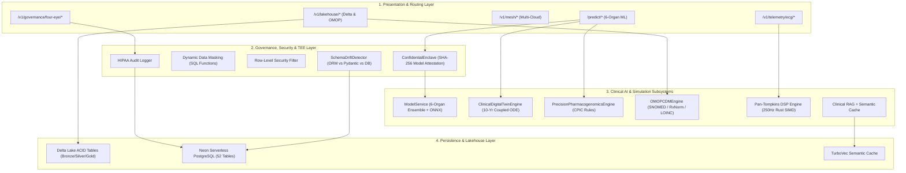

# Paper A: Formal System Architecture & C4 Component Specification

This document presents the formal **C4 Model Architectural Diagrams** for the AI Healthcare System, serving as primary figures for the **SoftwareX** system architecture paper.

---

## 1. System Context Diagram (C4 Level 1)

---

## 2. Container Diagram (C4 Level 2)

---

## 3. Detailed Component Diagram - Backend Engine (C4 Level 3)

